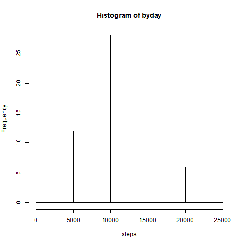
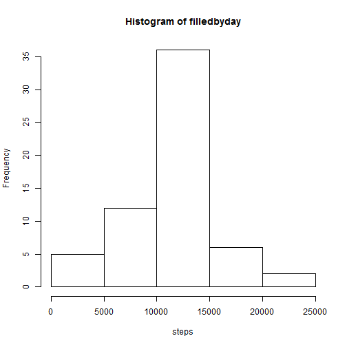
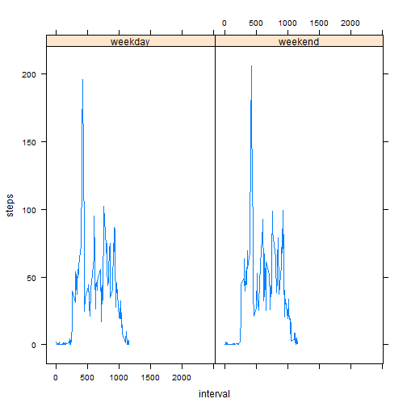

```r
library(dplyr)
library(magrittr)
library(lattice)
```

Store data in "data" and complete cases in "cleandata"

```r
data <- read.csv("./activity.csv")
cleandata <- data[complete.cases(data),]
```

Sort data by day in "byday"; create histogram; store mean and median in "meanbyday" and "medianbyday"; print mean and median.

```r
byday <- cleandata %>% group_by(date)
byday <-byday %>% summarise_each(funs(sum))
byday <-byday$steps
hist(byday, xlab = "steps")
```

 

```r
meanbyday <- mean(byday)
print("mean:", quote = FALSE); print(meanbyday)
```

```
## [1] mean:
```

```
## [1] 10766.19
```

```r
medianbyday <- median(byday)
print("median:", quote = FALSE); print(medianbyday)
```

```
## [1] median:
```

```
## [1] 10765
```
Sort data by interval in "byinterval"

```r
byinterval <- cleandata %>% group_by(interval)
byinterval <- byinterval[c(1,3)]
byinterval <-byinterval %>% summarise_each(funs(mean))
interval <- byinterval$interval
steps <- byinterval$steps
plot(interval,steps, type = "l", xlab = "interval", ylab = "steps")
```

 

report number of NAs

```r
nas <- length(data$steps) - length(cleandata$steps)
print("number of NAs:")
```

```
## [1] "number of NAs:"
```

```r
print(nas)
```

```
## [1] 2304
```

replace NAs with mean for that interval in "filleddata"

```r
filleddata <- data
n <- nrow(filleddata)
for (i in 1:n){
        if (is.na(data[i,1]) == TRUE){
                if (i%%288 == 0){
                        filleddata[i,1] <- byinterval[288,2] 
                }
                else{
                filleddata[i,1] <- byinterval[i%%288,2]
                }
        }
}
```

recomputed histogram, mean and median

```r
filledbyday <- filleddata %>% group_by(date)
filledbyday <-filledbyday %>% summarise_each(funs(sum))
filledbyday <-filledbyday$steps
hist(filledbyday, xlab = "steps")
```

 

```r
filledmeanbyday <- mean(filledbyday)
print("mean:")
```

```
## [1] "mean:"
```

```r
print(filledmeanbyday)
```

```
## [1] 10766.19
```

```r
filledmedianbyday <- median(filledbyday)
print("median:")
```

```
## [1] "median:"
```

```r
print(filledmedianbyday)
```

```
## [1] 10766.19
```

add 'Weekday" column and recompute

```r
dates <- as.Date(filleddata$date)
wkdys <- weekdays(dates)
n <- length(wkdys)
for (i in 1:n){
        if (wkdys[i] == "Saturday" | wkdys[i] == "Sunday"){
                wkdys[i] <- "weekend"
        }
        else{
                wkdys[i] <- "weekday"
        }
}
filleddata <- cbind(filleddata,wkdys)
filledbywkdy <- filleddata %>% group_by(interval, wkdys)
filledbywkdy <-filledbywkdy %>% summarise(mean(steps))
```

Plot based on weekday

```r
xyplot(steps ~ interval | wkdys, data = filledbywkdy, type = "l", xlab = "interval", ylab = "steps")
```

 
